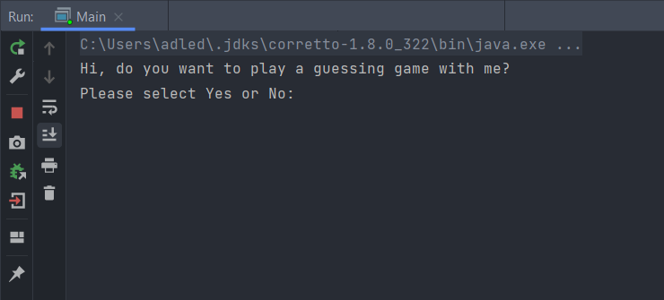

<h1 style="font-family: 'Times New Roman', Times, serif;">Guessing Game</h1>

    A game in which the player has to correctly guess the answer. 
    For example, the secret word is <b><q>apple</q></b> when the player knows the secret word, 
    he will win otherwise he has five times or that depends on 
    players in-game but  I choose five times only to guess the secret word. 

    Now play the guessing game with me and tell me what is the secret word. &#x1F60A; 
    

